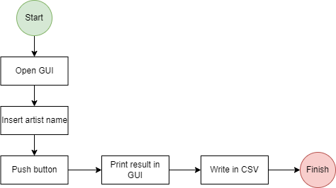
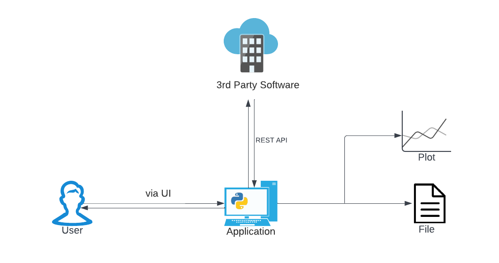

# Spotify API App
## About the project
The objective of this project is to make use of the Spotify API and get data on different artists. This data should be organized by their release dates in the last  5 or 10 years and displayed on the GUI and written in a CSV file.  
From a personal point of view, the main points to be touched during this project were the following:
 1. The use of an API to get a hold of data
 2. Sorting through the data and generating a CSV file
 3. Creating a user interface

## Architecture Diagram

## Built with
- Python 3.10
- REST API 
- Tkinter Package
- Requests Package
- [Spotify API](https://developer.spotify.com/console/get-search-item/)
- [PAGE Gui Builder](http://page.sourceforge.net)
## Getting started
 1. Clone repo
	 `git clone https://github.com/ca9000/spotify-api-app.git`
 2. Run "main.py" 

## Roadmap

 - [ ] Add Buttons with respective functions
	 - [ ] Past 5 years
	 - [ ] Past 10 years
 - [ ] Add the Spotify icon to the GUI
 - [ ]  Update CSV function

### Acknowledgments

 - [Spotify API Documentation](https://developer.spotify.com/documentation/web-api/)
 